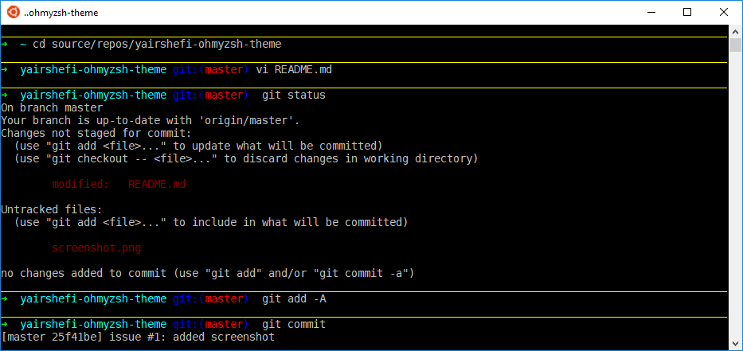

# yairshefi-ohmyzsh-theme
Simple ZSH Theme with Line-Separated Prompts

Based on [Robby Russell's theme](https://github.com/robbyrussell/oh-my-zsh/blob/master/themes/robbyrussell.zsh-theme).
Only difference is the addition of yellow line separators befor each new prompt, making it easy to spot new prompt while scrolling along.

# Screenshot

# Installation:
1. Put `yairshefi.zsh-theme`	in the folder `~/.oh-my-zsh/themes/`
2. In the file `~/.zshrc`, set the property `ZSH_THEME` to `yairshefi`

# Supported Plugins:
1. Git
2. Mercurial
